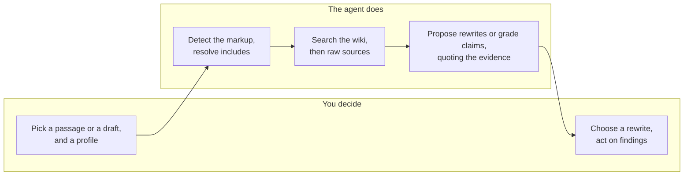

# WikiKit

[](LICENSE)

## Overview

Commands and skills for [Claude
Code](https://docs.anthropic.com/en/docs/claude-code),
[OpenCode](https://opencode.ai/) and similar agents that work against a local
[llm-wiki](https://github.com/nvk/llm-wiki) knowledge base. Point one at a
draft, a thesis chapter, a paper or a README, and it grounds what it says in
your own notes and sources: it fact-checks claims, or proposes rewrites of a
passage.

This is **not** a ghostwriter. Neither command edits your draft. `/wiki-rewrite`
prints options for you to pick from; `/wiki-check` writes a separate report that
quotes its evidence. What goes into the document is always your call.



## Setup

### Requirements

- [Claude Code](https://docs.anthropic.com/en/docs/claude-code),
  [OpenCode](https://opencode.ai/), etc.
- An [llm-wiki](https://github.com/nvk/llm-wiki) knowledge base on disk, with its
  `/wiki:ingest` command available for pulling new sources in

### Installation

Run the install script with your agent's folder as the destination. It installs
`commands/` and `skills/` under it:

```bash
curl -fsSL https://github.com/AluciTech/wiki-scitools/releases/latest/download/install.sh | bash -s -- .claude
```

To pin a specific version:

```bash
curl -fsSL https://github.com/AluciTech/wiki-scitools/releases/latest/download/install.sh | bash -s -- --version v1.1.0 .claude
```

The script asks before overwriting a file you already have. `--no-config` skips
the config step below.

### Configuration

Config lives under a `wikiKit` key in your agent folder's
`$PROJECT_DIR/{.claude,.opencode,.agents}/settings.local.json`, next to the
agent's own settings:

```json
{
  "permissions": { "allow": ["Bash(npm test)"] },

  "wikiKit": {
    "defaultProfile": "academic",

    "knowledgeBase": "/absolute/path/to/your/wiki",
    "reportsDir": "reports",

    "profiles": {
      "outreach": { "knowledgeBase": "/absolute/path/to/your/outreach/wiki" }
    }
  }
}
```

The installer adds this block for you. If the file already exists, it backs it
up and merges the block in without touching your other keys. If you already have
a `wikiKit` block, it leaves it alone. Then **set `knowledgeBase`** to your
wiki's absolute path. That is the only required key. Template:
[`docs/templates/settings.local.example.json`](docs/templates/settings.local.example.json).

| Key | Meaning | Default |
|---|---|---|
| `knowledgeBase` | absolute path to an llm-wiki topic wiki | **required** |
| `defaultProfile` | profile used when none is passed | `plain` |
| `reportsDir` | where `/wiki-check` writes, relative to the **draft** | `reports` |

Three keys, and that is deliberate. What lives *inside* the knowledge base is
llm-wiki's business: a topic wiki always has `wiki/`, `raw/` and `inbox/`, so
there is nothing to configure and nothing to keep in sync. Point at the topic
wiki (`<hub>/topics/<name>/`), not at the hub, which holds no content.

#### Where each path is anchored

`knowledgeBase` is the library; `reportsDir` is the desk, beside the paper.

```
/home/you/wiki/topics/these/  <- knowledgeBase; llm-wiki owns everything below
├── wiki/                     <- compiled articles  (read)
├── raw/                      <- ingested sources   (read)
└── inbox/                    <- drop zone          (read)

/home/you/projects/paper/     <- your draft lives here; not configured anywhere
├── main.tex                  <- the file you pass to /wiki-check
└── reports/                  <- reportsDir         (written)
    └── review_v1.md
```

So `reportsDir` is a folder *name*, not a location. Set it to `audits` and
reports land in `/home/you/projects/paper/audits/`. Reports follow the draft, so
they version alongside the paper instead of scattering per-draft output through
shared reference material. Give it an absolute path if you would rather collect
every report in one place.

Top-level keys are defaults. An entry under `profiles` overrides them for that
profile, for example to point `outreach` at a different wiki. A profile with no
entry inherits every default.

These files hold absolute paths to private material and are gitignored. Do not
commit yours.

## Available commands

| Command | Description | Writes |
|---|---|---|
| `/wiki-rewrite <file:line> [n] [profile]` | N drop-in rewrites of one passage, grounded in the wiki, each varying along a named axis | nothing, prints to the console |
| `/wiki-check <file[:start-end]> [profile]` | Extracts every claim in a draft and grades it Accurate, False, Needs nuance or Unverifiable, quoting the evidence | one new `reports/review_v<N>.md` next to the draft |

`/wiki-check` follows the draft's include directives, so pointing it at
`main.tex` checks the whole document. It never overwrites an earlier report.
Anything it cannot find is *Unverifiable*, never *False*: a *False* verdict
always quotes the source that contradicts the draft.

## Usage

```bash
/wiki-rewrite sections/intro.tex:356 3
/wiki-rewrite chapters/methodo.typ:88 4 academic
/wiki-rewrite docs/quickstart.md:40 3 technical
/wiki-rewrite rfcs/0007-storage.md:21 3 engineering
/wiki-rewrite src/parser.rs:114 2 plain

/wiki-check main.tex
/wiki-check thesis.typ academic
/wiki-check abstract.tex:1-60 outreach
/wiki-check docs/api.md technical
```

### Profiles

Profiles are split by what the document is *for*, not by who writes it. An
engineer writing a user guide wants `technical`; the same engineer writing an
RFC wants `engineering`.

| Profile | Audience | Job |
|---|---|---|
| `academic` | reviewers, peers in the field | defend a claim |
| `outreach` | educated non-specialists | make a result understandable without deforming it |
| `technical` | someone using the thing | get them to a working result |
| `engineering` | peers reviewing a decision | make the reasoning auditable |
| `plain` | whoever the document already addresses | handle it on its own terms |

The profile changes the audit, not just the prose. `outreach` treats a dropped
hedge as *False*; `academic` treats hedge drift as *Needs nuance*; `technical`
treats a paraphrased flag name as *False*; `plain` never flags genre
expectations.

### Markup support

LaTeX · Typst · Markdown · plain text · comments and docstrings in source files

The markup is detected for each file: the extension gives a first guess and the
surrounding lines decide. Citation keys, labels, cross-references, placeholder
tokens and front matter are carried through verbatim. Include directives
(`\input{}`, `\include{}`, `#include`, ...) are resolved relative to the including
file, with cycle detection and a depth limit.

## Maintainers

### Releasing a new version

1. Make sure all changes are committed and pushed to `main`.
2. Tag the commit and push the tag:

   ```bash
   git tag v1.1.0
   git push origin v1.1.0
   ```

3. The `release` workflow creates a GitHub Release with `install.sh` attached as
   a downloadable asset.

### Extending

Each part lives in its own layer, so adding a genre or a markup language never
means copying a pipeline:

| Layer | Lives in | Shared across commands |
|---|---|---|
| Trigger and arguments | `commands/` | no, thin delegation |
| Method and pipeline | `skills/<name>/SKILL.md` | no, one per command |
| Profiles | `skills/_shared/profiles/*.md` | **yes** |
| Markup handling | `skills/_shared/references/syntax-detection.md` | **yes** |
| Config resolution | `skills/_shared/references/config-resolution.md` | **yes** |
| Raw source access | `skills/_shared/references/source-ingestion.md` | **yes** |
| Asking the user | `skills/_shared/references/asking-the-user.md` | **yes** |

**A new profile.** Create `skills/_shared/profiles/<name>.md` with an
audience/job line and five sections, each tagged with the command that uses it:
`## Voice (wiki-rewrite)`, `## Variant axes (wiki-rewrite)`, `## Claims
(wiki-check)`, `## Constraints (both)`, `## Syntax notes (both)`. Keep it under
~45 lines, since it is loaded into the prompt.

**A new markup language.** Add rows to `syntax-detection.md`: the extension
table, the table of constructs to carry through, and the include table if the
language has includes.

**A new command.** Create `commands/<name>.md` (thin, delegating) and
`skills/<name>/SKILL.md` (pipeline only), and read profiles, markup rules and
config from `../_shared/`.

## License

This project is licensed under the Apache License (Version 2.0).

See the [LICENSE](LICENSE) file for details.

## AI Usage Transparency

This project uses AI tools to assist with development. For more details, see the
[AI Usage Disclosure](AI_USAGE.md) file.
